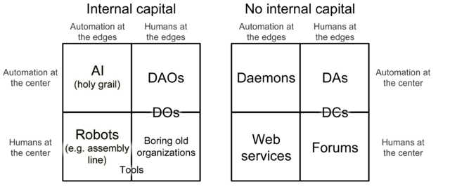

# DAO/DAC Governance Case Studies

## What is DAO?

A decentralized autonomous organization \(DAO\), sometimes labeled a decentralized autonomous corporation \(DAC\), is an organization that is run through rules encoded as computer programs called smart contracts. A DAO’s financial transaction record and program rules are maintained on a blockchain. There are several examples of this business model. The precise legal status of this type of business organization is unclear. © Wikipedia Bitcoin was effectively the first DAO as it relies on and rewards the wide group of miners. Valuation of bitcoin is heavily dependent on the support of it’s users. It’s rudimental, still fully decentralized organization. More sophisticated visions of DAO assume hiring, marketing and R&D decisions made automatically by voting, with no CEO, Board or substitute. And any user is authorized to make their proposals and all the laws are preprogrammed.

In blockchain governance, it seems like this is the only way forward as well. The approach for blockchain governance that I advocate is “multifactorial consensus”, where different coordination flags and different mechanisms and groups are polled, and the ultimate decision depends on the collective result of all of these mechanisms together. These coordination flags may include:

* The roadmap \(ie. the set of ideas broadcasted earlier on in the project’s history about the direction the project would be going\)
* Consensus among the dominant core development teams
* Coin holder votes
* User votes, through some kind of sybil-resistant polling system
* Established norms \(eg. non-interference with applications, the 21 million coin limit\)

by Vitalik

Organization = Markets + Public goods + Relations

## Benefits

Most of the DAO benefits are connected with scaling the governance, mostly around public commodities. Automating the governance brings the next benefit:

* Rapid evolvement and acceptance of needed technical improvements
* Reduced costs and time for coordination
* Protection from instability and chain splits
* Protection from becoming too de-facto centralized \(see The Tyranny of Structurelessness\)

## Weaknesses / Criticism

* Game theory attacks 
* Non-representative
* Centralisation

> Vlad Zamfir, a principal architect of Ethereum’s proof of stake, [feels](https://www.youtube.com/watch?v=9RtSod8EXn4&feature=youtu.be&t=2h33m39s) “the risks far outweigh the rewards” and “represent an extremely risky proposition”.

## Dark DAOs

## References:

* [DAOs, DACs, DAs and More: An Incomplete Terminology Guide](https://blog.ethereum.org/2014/05/06/daos-dacs-das-and-more-an-incomplete-terminology-guide/) by Vitalik Buterin
* [Notes on Blockchain Governance](https://vitalik.ca/general/2017/12/17/voting.html) by Vitalik Buterin, Ethereum
* Bootstrapping A Decentralized Autonomous Corporation: [Part 1](https://bitcoinmagazine.com/articles/bootstrapping-a-decentralized-autonomous-corporation-part-i-1379644274/), [Part 2: Interacting With the World](https://bitcoinmagazine.com/articles/bootstrapping-an-autonomous-decentralized-corporation-part-2-interacting-with-the-world-1379808279/), [Part 3: Identity Corp](https://bitcoinmagazine.com/articles/bootstrapping-a-decentralized-autonomous-corporation-part-3-identity-corp-1380073003/) by Vitalik Buterin, Ethereum
* [Blockchain Governance: Programming Our Future](https://medium.com/@FEhrsam/blockchain-governance-programming-our-future-c3bfe30f2d74) by  Fred Ehrsam
* [Against on-chain governance](https://medium.com/@Vlad_Zamfir/against-on-chain-governance-a4ceacd040ca) by Vlad Zamfir, Ethereum
* [DAOs, Democracy and Governance](http://merkle.com/papers/DAOdemocracyDraft.pdf) by Ralph C. Merkle
* [Decentralized Autonomous Organizations](http://www.allenovery.com/SiteCollectionDocuments/Article%20Decentralized%20Autonomous%20Organizations.pdf) by Allen & Overy
* [\#TrueDAO](https://blog.colony.io/truedao-d270a94877b1) by Colony
* [5 ways blockchain can accelerate open organizations](https://opensource.com/open-organization/17/11/blockchain-revolution-part-1) by Ron McFarland
* [Blockchains should not be democracies](https://hackernoon.com/blockchains-should-not-be-democracies-14379e0e23ad) by Haseeb Qureshi
* [On-Chain Governance meetup](https://www.youtube.com/watch?v=AOlS4QddpNI) by W3F July 2018
* [Thoughts on Governance and Network Effects](https://blog.aragon.org/thoughts-on-governance-and-network-effects-f40fda3e3f98/) by Luke Duncan, Aragon
* [The Price and Value of Governance](https://www.youtube.com/watch?v=Mwv4nnvTI5E) by Joel Monegro, Placeholder VC
* [https://medium.com/@decanus/against-community-governance-326dc82b27d3](https://medium.com/@decanus/against-community-governance-326dc82b27d3)
* [https://medium.com/@decanus/blockchains-are-not-companies-9f8ed7c13018](https://medium.com/@decanus/blockchains-are-not-companies-9f8ed7c13018)
* [On-Chain Vote Buying and the Rise of Dark DAOs](http://hackingdistributed.com/2018/07/02/on-chain-vote-buying/) by Philip Daian, Tyler Kell, Ian Miers and Ari Juels

