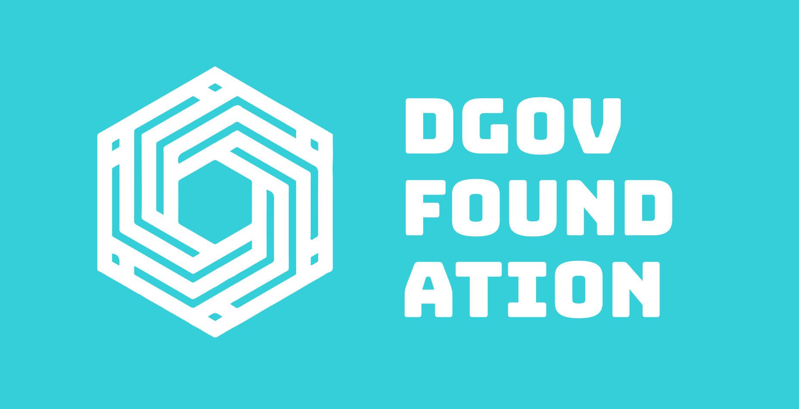

# About us

## Core Team

### Tim Bansemer

Entrepreneur \| Founder of inblock.io GmbH & Co.KG \| Blockchain  
  
Tim Bansemer has a background in Network Engineering and IT Security as a Security Engineer before joining the Blockchain Space. His roles were RChain European Ambassador in 2018. He is founder of the blockchain companies inblock.io labs and inblock.io events and initiator of the \#dgov initiative.  
  
Tim Bansemer acts also as a public speaker with a focus on distributed governance and new scalable blockchain solutions which he hopes will one day reshape society to create sustainable and direct participatory societal structures.  
  
Twitter [@tim\_bansemer](https://twitter.com/tim_bansemer)

### Max Semenchuk

Entrepreneur, Product Manager, UX Designer. Speak, Write, Consult on \#Decentralization, \#Holacracy, \#Lean, \#DAO. Partner at [4IRE labs](https://4irelabs.com/), [Teal UA](http://teal-ua.org/)

### Anja Blaj

Anja is a legal professional focusing on Space law and Blockchain legal matters. She is responsible for managing activities at the European Blockchain Hub based in Slovenia and is supporting EU - ASIA relationships for blockchain associated businesses. She is co-creator of the DGOV initiative.  
  
Twitter: [@AnjaBlaj](https://twitter.com/AnjaBlaj)

### Phoebe Tickell

Distributed self-governing network Enspiral \(NZ\) Organisational innovation lab Percolab \(CA\).

Is decentralization always the answer? When is decentralization \*not\* the most appropriate system to use in organising? What are the questions necessary to ask in making those decisions? I am interested in the deep social protocols and legal structures necessary to actualise decentralised/distributed organising and governance of assets in the real world. Debunking DGOV hype.

### Ela Kagel

Digital strategist Ela Kagel specialises in the intersection of society, technology and economy. Since the 1990s she has been working as curator and program advisor for major art & tech festivals such as Transmediale, Republica, Ars Electronica and more.

Ela is co-founder and managing partner of [SUPERMARKT](https://supermarkt-berlin.net/), a collaborative economy hub in Berlin. Central to Ela’s practice is working with grassroots communities and dgov practitioners all over Europe. Over the past years, she has been extensively researching and advocating for the digital commons. As part of her ongoing collaboration with the Platform Coop Consortium Ela is co-hosting the Platform Coop meetups in Berlin. 

### Martin Unruh

...

### Aeon Hochberg

...

## History

* May 2018 – EthCC discussions about the conference
* June 2018 – Working group establishe
* Sep 2018 – First \#dgov meetup in Berli
* Oct 2018 – Conference postponed, focus on community building
* Jan 26-28, 2019 – First community council
* ...

## Publications

* [What is Distributed Governance?](https://medium.com/dgov/what-is-distributed-governance-3b103eb082c0)
* [How to improve the economy with better organizations and technology](https://irishtechnews.ie/how-to-improve-the-economy-with-better-organisations-and-technology-max-semenchuk-dgov/) for IrishTechNews
* [https://akasha.org/blog/2019/02/08/distributed-governance](https://akasha.org/blog/2019/02/08/distributed-governance)
* [Future Thinkers Podcast: Collective intelligence and meme tribes](https://futurethinkers.org/collective-intelligence-and-meme-tribes/)
* [Alive and Kicking: Decentralized Governance Picks Up Momentum](https://irishtechnews.ie/alive-and-kicking-decentralized-governance-picks-up-momentum/)

