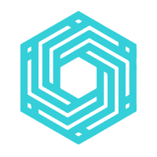

# Logo / Identity

\#dgov – all equal, no domincation

\(better the DGov, DGOV or Dgov\)

Sign = Galaxy + Complex Yin Yang

* More on [https://www.figma.com/file/VOljSsjBw43q9x6xi5ZYwNf0/DAO-Foundation?node-id=0%3A1](https://www.figma.com/file/VOljSsjBw43q9x6xi5ZYwNf0/DAO-Foundation?node-id=0%3A1)
* Print materials \(tshirts, banner, poster etc\): [https://drive.google.com/drive/folders/1Mhr9h0SJIE-gcqsUHd\_rT9asBPzlMrSM?usp=sharing](https://drive.google.com/drive/folders/1Mhr9h0SJIE-gcqsUHd_rT9asBPzlMrSM?usp=sharing)

