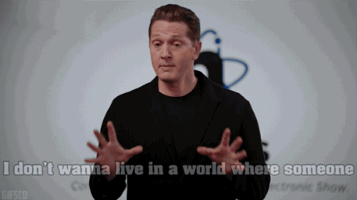

# \#dgov memmes



## Stickers

[https://www.figma.com/file/VOljSsjBw43q9x6xi5ZYwNf0/%23dgov-graphics?node-id=106%3A6](https://www.figma.com/file/VOljSsjBw43q9x6xi5ZYwNf0/%23dgov-graphics?node-id=106%3A6)

* butter principle
* spaceship earth
* DAO space monkey
* lets go to the rabbit hole
* hi, I’m \_\_\_\_\_\_\_\_\_\_\_\_ and I’m an egomaniac
* dlov for dgov
* horizontal chicken
* minimum viable governance

### Coop anti-patterns

* don’t trust
* don’t share
* keep all in secret
* build moats
* ego first
* seek rent
* find truth in absolute
* defeat competitors

## Unsorted:

Dancing space monkeys

don’t bring the lambo to the devcon

where did it come from? it’s emergent

self organization is not self organizing

Malthusian trap is a thing, but I’ll bring you a sandwich anyways

### 

