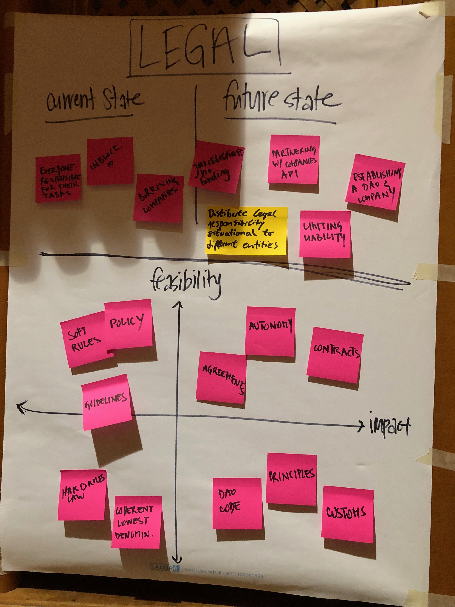

# Newsletter \#13 \(september\)

Hello i'm member X \(details\) and here's what on the top of my mind:

> 1 sentence

## 👨‍👨‍👦‍👦 Dgov Network Updates

### Community highlights

We've build the dgov network map with [graph commons](https://graphcommons.com/) tool. [Follow the link](https://graphcommons.com/graphs/6a993e34-d8b0-4425-83ce-67c3560429e7?auto=true&svg=true) reorder and click play to see how it moves dynamically – looks super cool! It's still work in progress. If you need something changed or added \(like yourself or your organization\) – please [create an issue](https://github.com/distributed-governance/map/issues) or ping Max \(e.g. here in the reply\).

Creating of this map led to the discussion of the  Self Sovereign ID for dgov network \(ideas like matchmaking, reputation etc\). [Join the conversation here](https://forum.dgov.foundation/t/self-sovereign-id-for-the-dgov-network/82).

### Web3 dgov node

Berlin Blockchain week was full of great events. We had DAOfest, Governance Games and of course the \#dgov node at web3 summit. If you have missed it – we've captured all videos from the lightning talks and notes from the panels. Here're my top3 picks:

* [Ecosystem Funding DAOs](https://forum.dgov.foundation/t/transcript-panel-ecosystem-funding-daos-dgov-node-at-web3-2019/79)
* [Self Sovereign Identity in the distributed governance](https://forum.dgov.foundation/t/transcript-panel-identity-in-dgov-dgov-node-at-web3-2019/77)
* [Bridging the divide between decentralized orgs / coops etc with DAOs](https://forum.dgov.foundation/t/transcript-panel-bridging-the-divide-between-decentralized-orgs-coops-etc-with-daos-dgov-node-at-web3-2019/80)

Find full agenda and materials [on our forum](https://forum.dgov.foundation/t/web-3-summit-dgov-node/63).

### Also this month we're welcoming

* Laura Harvey – Certified Trainer in NVC shared space.org.uk
* Ola Kohut – Ecosystem Strategy & Partnerships at [Autark](https://www.autark.xyz/)
* Aaron Gillett – a multidisciplinary designer, working to transform architecture and cities for a distributed and collaborative future.
* Benoît Kulesza – Founder of a collaborative software company, our target is to run our community through a DAO
* Louis Kinley – working towards self sovereign identity and returning control of data to its owners. We make interactions near impossible to trace and peer to peer encrypted communication the norm.
* [Stephen Reid](http://stephenreid.net) – a social entrepreneur, activist and public speaker. He is currently a co-director of the Psychedelic Society, which he founded in 2014 and has become one of the global leading providers of legal psychedelic retreats. Previously, he was the youngest ever board member of Greenpeace UK, co-founded the New Economics Foundation's New Economy Organisers Network and worked as a technology consultant for organisations including the Labour Party, the Green Party and 350.org. Stephen has an MPhys in Physics from the University of Oxford, where he specialised in quantum field theory, and an MRes in Complexity Sciences from the University of Bristol.
* Terae De Cou – partners with CEOs and entrepreneurs of small tech startups to help them do everything that they and their engineers don't do. A multifaceted business asset that is fluid can strategically fill the gaps, create processes and systems, and provide training for maintenance handover.
* Mars Robertson – Operating system for the planets: [https://genesis.re/](https://genesis.re/) A lot of stuff on the wiki: [https://genesis.re/wiki](https://genesis.re/wiki)
* Rahmin Sarabi – A human-centered advocate for thriving governance, organizations, and cultures. Recent focus on transcending polarities for integrated wisdom
* Rafael Calcada – created social network askker.io and now developing [plurall.network](http://plurall.network/) . His idea is to help decentralize communication platforms.
* Pascal Hazeleger – a startup/impact investor. I am very interested in developing new governance models for platforms we support.
* Philip Steenekamp – Enterprise Architecture
* Charles Adjovu – works as a co-operator and researcher at Ledgerback, an independent, distributed think-and-do tank and steward for the digital and knowledge commons. His previous work generally examines the legal implications of blockchain in the USA, blockchain case studies in industry, and governance concerns for blockchain and open source communities in general
* Paulo Alves – a consultant and Facilitator, working on Systems Thinking, System Change and Social Innovation
* Ruby Wu – Partner at ASResearch
* Laurie Michaelis – his core inquiry is around how humans can develop the collective intelligence, values and practices to flourish - as individuals, as collectives and in relation to the planet. He has a background in climate policy and collaborative/community approaches to sustainable living. Worked within Quakers in Britain on these issues since 2001, and since 2016 have been working with several different organisations and networks, including Global Ecovillage Network, Climate Psychology Alliance, Extinction Rebellion and others. Particularly interested in organisation and governance. Sociocracy \(used by GEN\) and Holacracy \(used by XR\) are inspired by Quaker structure and process, which at its best is Yellow in Spiral Dynamics.
* Leo Morozovskii – Investor, Finance guy, MBA, PhD, Blockchain enthusiast.
* Zhongqian Ding – working for web3 foundation research team now
* Paula Berman – does operations for Democracy Earth Foundation, a nonprofit developing governance & identity protocols.
* Harry Hendrickx – Advisor, strategische, coach, program manager and consultant for transformation initiatives and business governance. Harry has been responsible for aligning IT operations to business and technology strategy as a Chief Technology Officer in IT Operations for Telecom Service Providers
* Sharon Sciammas – just explorer :\)
* Robert Doerzbach – an innovation management & marketing student at TU Munich. Besides studies I works for Staking Facilities GmbH. Plans to write a master thesis about New Institutional Economics in the age of DAOs
* Kenneth Nicholson – Plans to build a DAO for book clubs
* Link da Niel – Interested in DAOs
* Keishi Shimmachi – a university student, majoring in business management. Currently interested in blockchain technologies and DAO.
* Mitchell Travers – works as a business developer at bronID. The bronID portal is a Complete KYC, AML, CTF Toolkit for Global Compliance.
* Bartolomej Kozorog – Interested in modern fields that inhibit complex systems thinking such as Distributed Systems, Game Theory,.. Developer by skill, constant learner by hearth.
* Gerrie Smits – When everybody zigs, I'm curious about the zag. A freelancer, trying to help business understand concepts like blockchain/decentralisation. Particularly interested in new organisations and how projects/platforms like Commons Stack, Colony,... can facilitate that.
* Benjamin Du Peloux – a contributor and board member of the MANA project : an environmental index that brings the voice of civil society to investors. An NGO with the goal to make the information, i.e. negative impacts of corporate, free and available for everyone. In the mid term looking at a decentralized governance of the tech and ecosystem.
* Joe Charlesworth – runs [www.prediction.vc](www.prediction.vc), a new type of VC/Incubator using Aragon & Colony. Also organising Eth Lisbon and Lisbon Blockchain Week.
* Justine Hannequin – a freelance product designer specialized in pedagological use case. Had several experiences with governance system, reverse-engineering them and experimenting in how they can be visualized by the whole group.
* Ana Gutierrez Jordano – quite resourceful developer, based in Sevilla, Spain, and part of a small community there called La Colmena. DAOs and governance are the biggest topics for her in blockchain, so this is what I am working on, making workshops, meetups and contributing code to.

### Upcoming events

* [Enspiral Org Academy](http://enspiralorgacademy.co/) \(Sep 5-8, Belgium\)
* [Massive Adoption Crypto Festival](https://www.massiveadoption.com/) \(2020\)

Do you want to support the dialogue, action and change in your cities – [Host local meetups](https://forum.dgov.foundation/t/host-local-meetups/42)

## ⚖️ Cryptolaw updates

This month has been all about legal entities for DAOs! The news about DOrg LLC DAO is still echoing strong and many have been thinking whether coming together virtually, pooling the funds and managing them in a coherent, democratical way through votes is worth the risk. Without a legal entity, all DAO members enter into a “general partnership” which puts everyone at risk all stakeholders, DAO members can be liable for debts or legal actions that a DAO may undergo. This is why through history we have created legal instruments and entities with a limited liability. Yet, the important part is the configuration of a legal entity and the process one needs to go through in order to bring more clarity and certainty regarding the risks members are taking. 

Many have written about and we highly recommend articles published by the [OpenLaw](https://medium.com/@OpenLawOfficial/the-era-of-legally-compliant-daos-491edf88fed0). 

We also addressed the legal perspectives and challenges of a DAO on our DGov Node at the Web3 Summit. Check out our outcomes: 

We were also lucky to hear some thoughts Stephen Palley and Vlad Zamfir shared on a panel regarding Szabo’s Law and Vlad’s perception of the emerging crypto law. While Palley made a solid statement smart contracts automate the performance components of a contract, he does not support the idea of a consensus protocol as an agreement. We witnessed quite a debate about the governance, which is supposedly required with human interaction and debatably not with the code. 

Another thing Blockchain Week brought to us is the new programming language for lawyers, [Lexon](http://lexon.tech/). It holds the potential to integrate smart contracts with agreements lawyers are used to read and make the programming languages much more pleasant for a lawyer’s eye. Not only are we excited for this phenomenal user experience but also the possibility to digitalize long pages of text and make the performance component much fluid, transparent and automated.

Follow Anja on [Twitter](https://twitter.com/AnjaBlaj)

## 😂 Having Fun

Regular collection of memes from Pedro Parrachia and the Ministry of Memes.

Follow Pedro on [Twitter](https://twitter.com/parrachia)

## 🎗️ Support the Movement!   

If you're enthusiastic about the distributed governance – go give us a hand. Here're some tips on what's going on in the dgov movement: [join](https://dgov.foundation/#join), [twitter](https://twitter.com/dgovearth), [website](http://dgov.foundation), [events](../collaboration-1/dgov-industry-landscape.md)

If you want your info published in this newsletter – ping me \(Max\) in the reply.

