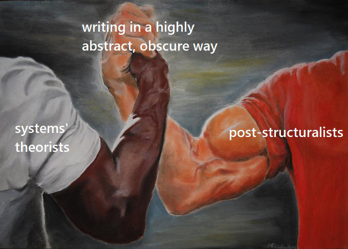

# Newsletter \#7 \(march\)

Hi friends, Max here.

The spring feels really good! Hope the new cycle will bring a lot of inspiration and enlightenments for all of us. Btw check out how ecosystem matures.

Once more we've tried to gather the updates within our range of vision. If we haven't covered your project or initiative – please get in touch and we'll resolve this.

## 1. Coordination

### \#dgov Community

Thanks to [Thom Ivy](https://twitter.com/thom_ivy_1) from Edgeware that organized an indie \#dgov event during RadicalxChange conference in Detroit with ~35 people on board. [Next meetup](https://www.eventbrite.com/e/decentralized-governance-and-daos-meetup-with-lightning-talks-tickets-59638108187) is planned in Amsterdam on Apr 16.

### OrgTech Review Highlights

Previously we mentioned interesting \#dgov articles published during the month. But then Jack Laing's [Org.tech review](https://orgtech.substack.com/) launched, which is more elaborate and frequent \(weekly\). Check out a couple of highlights and definitely subscribe.

MeshHub: At 1:01:00, get a glimpse of the DAO experiment going on inside ConsenSys, with a Slack tipbot, 3Box identities, and an interface for Gitcoin's "Kudos" non-fungible tokens. [https://consensys.zoom.us/recording/play/u5XC\_Qa1rFnfZkPHslhDX4TcEyVsQgeGzj-1y\_DOk8zxfOyVk-VzxJ3pIJ251J0h?continueMode=true](https://consensys.zoom.us/recording/play/u5XC_Qa1rFnfZkPHslhDX4TcEyVsQgeGzj-1y_DOk8zxfOyVk-VzxJ3pIJ251J0h?continueMode=true)

P2P Models: P2P Models, a research project based out of Universidad Complutense Madrid, have put together a proof-of-concept decentralised wiki managed by an Aragon DAO. [https://twitter.com/p2pmod/status/1103371929707114496?s=21](https://twitter.com/p2pmod/status/1103371929707114496?s=21)

A Cooperative Manifesto: There is no more important social change work you can do than cooperative development, because fundamental change is needed to solve capitalism's failures, solving these failures is more important than convincing people the failures exist, and people need concrete \(not theoretical\) solutions they can rally around. True democracy does not exist if we spend our working lives in autocratic organisations, because this means we are more likely to submit to autocratic leaders elsewhere \(e.g. in politics\). Therefore, the worker cooperative is perhaps the most important modern experiment in the historical democratisation of society. [http://www.geo.coop/archives/huetman604.htm](http://www.geo.coop/archives/huetman604.htm)

Past, Present, Future: From Co-ops to Cryptonetworks: Cryptonetworks represent a shift towards cooperative capitalism, with participatory ownership models that would prevent platforms from adopting extractive practices once they reach maturity. Cryptonetworks make cooperative governance more efficient, but we should still be mindful of the lessons we can learn from the history of cooperatives. [https://a16z.com/2019/03/02/cooperatives-cryptonetworks/](https://a16z.com/2019/03/02/cooperatives-cryptonetworks/)

Markets Are Eating The World: An in-depth history of how various innovations have reduced transaction costs and increased coordination scalability, arguing that blockchains realise the next evolution in "the death of the firm". [https://www.ribbonfarm.com/2019/02/28/markets-are-eating-the-world/](https://www.ribbonfarm.com/2019/02/28/markets-are-eating-the-world/)

&gt; [Subscribe for a weekly newsletter here](https://orgtech.substack.com/)

### DAO Talk Forum Highlights

* [Genesis Beta - what do we want to be](https://daotalk.org/t/genesis-beta-what-do-we-want-to-be/388)
* [Case Studies: Decentralized Orgs with On-chain Governance](%20https://daotalk.org/t/case-studies-decentralized-orgs-with-on-chain-governance/395)

### Ethereum Research Forum / Economics​ Highlights

* [Ideation session: Reasonably fair algorithm to measure current contribution](https://ethresear.ch/t/ideation-session-reasonably-fair-algorithm-to-measure-current-contribution/5194)

### ​Aragon Research Forum​ Highlights

* [Jurisdiction for Crypto Natives](https://forum.aragon.org/t/jurisdiction-for-crypto-natives/568)
* [Aragon Network Vote \#2 Megathread](https://forum.aragon.org/t/aragon-network-vote-2-megathread/661)
* [DAO for an Open Source Code Academy](https://forum.aragon.org/t/dao-for-an-open-source-code-academy/664)
* [Community Initiative: Aragon Cooperative](https://forum.aragon.org/t/community-initiative-aragon-cooperative/356)
* [Aragon Coop DAO - A Minimun Viable Manifesto \(MVM\)](https://forum.aragon.org/t/aragon-coop-dao-a-minimun-viable-manifesto-mvm/690)

### Upcoming events

* [Decentralized Governance and DAOs](https://www.eventbrite.com/e/decentralized-governance-and-daos-meetup-with-lightning-talks-tickets-59638108187) \(Apr 16, Amsterdam\)
* [DAOCon](https://daocon.io/) \(Apr 26, Split, Croatia\)
* [Governance and new organizational challenges](https://www.eublockchainforum.eu/events/governance-and-new-organizational-challenges) \(Apr 30, Brussels\)
* [Steps 2019](https://www.blockchainforscience.com/2019/01/31/steps_barcelona/) \(May 10-11, Barcelona\)

## 2. Education

Dgov Landscape Research group did 2 tactical calls with 5-8 people on board, established the preliminary scope, appointed Pedro Parracia as coordinator. Goal is to push the first version of the report in the next 2 month. Setting up funding proposal for preliminary research in Genesis.

## 3. Incubation

DAO Incubator got 5 incubation request and gathered a group of 12 mentors around. Current tasks are forming the incubation practice and establishing relations with key organizations in the field.

Follow the progress on [https://twitter.com/DAOincubator](https://twitter.com/DAOincubator)

## 4. Regulation

Thanks to [Anja Blaj](https://twitter.com/AnjaBlaj) for the summary of the Paris week that included the COALA workshop, EthCC and more.

### **COALA’S CANDY**

The smell of freshly baked French pastries and coffee at Le Square is where [COALA](https://coala.global/)s woke up on a Saturday evening and gathered to talk about legal challenges in blockchain ecosystem. For those who haven’t heard about COALAs just yet, the abbreviation stands for Coalition Of Automated Legal Applications. 

COALA workshop in Paris aimed for identifying bridges between DAOs and the non-blockchain world, the physical space that surrounds us. One can observe less and less tendency to form an  anarchist movement, aiming for total destruction and reformation of traditional institutions humanity formed in last couple of centuries. Today people are focusing on possible ways of evolving, upgrading the existing systems we live in. 

A glimpse over [COALA’s working groups](https://coala.global/working-groups/) and modules names some of the most important legal fields we need to address to form bridges between blockchain and the rest of the existing world and thus make a more inclusive community. From taxation gateways, tort and liabilities to contractual gateways and identification manifestation of a DAO. We have also addressed relationships between DAOs and the perils autonomous DAO presents. 

Discussions were intense, and each module had it’s own moderator which presented the attendees with a concrete example, a challenge his or her project is facing. Together with [Silke Noa Elrifai](https://twitter.com/silkelrifai), [Marina Markežič](https://si.linkedin.com/in/marinamarkezic), [Florence Guillaume](https://www.linkedin.com/in/florence-guillaume-73aa49a9/?lipi=urn:li:page:d_flagship3_search_srp_top;ygfOhnxeRnC2JZq8OGOBUA==&licu=urn:li:control:d_flagship3_search_srp_top-search_srp_result&lici=k/VNhfNuQ/i/lCFicOaX5Q==) and Sven, we talked about DAOs interoperability, links and how we might possibly break some of the links in order to make a newly established DAO free and independent of its predecessor. 

We started writing it down and are still working on governing principles of DAOs. We call it the ‘’Magna Carta DAO’’ or ‘’10 Commandments for DAOs’’. These principles correspond to an organisational model very similar to ‘’statutes’’ DAO members may choose to opt-in. Our wish is to make this as general and overarching as possible. Our wish is to find and collect what’s common to all DAO creators and see if we can form shared principles together. 

This is in no way restrictive and we aim for voluntary adherence while keeping in mind a level of formalisation and DAO representation is more then welcomed if we want to enable the regulators and authorities to follow and understand DAO positioning regarding non-platform liability for third party actions. 

COALA workshops bring together one of the most amazing crypto lawyers, philosophers, creative projects and thought leaders \(I know, this term is a bit outdated\). There will soon be another one and perhaps we might be reporting making our work even more conspicuous. 

### **ETHEREUM TART**

COALA workshop was just a prep, never before have I seen Ethereum Community inviting and seeking legal support so loudly. Check out the [schedule](https://ethcc.io/images/schedule/EthCCcomplete.pdf) [Asseth](https://ethcc.io/) \(a nonprofit dedicated to free education and promotion of the Ethereum ecosystem\) prepared for the Paris EthCC. 

If you’re interested in legal aspects, here’s a short list of ETH talks and workshops you might want to \(re\)watch, get more info about:

* [Qianchen Yu: "Beyond the technology, how about building a legally-compliant DAO?”](https://www.youtube.com/watch?v=gv81W2Xc6C0)
* [Xavier Lavayssière: "From legal entities to digital ecosystem](https://www.youtube.com/watch?v=KcpiBcYCZxg)”
* [Vlad Zamfir: "Blockchain Governance](https://www.youtube.com/watch?v=PKyk5DnmW50&feature=youtu.be)”
* [Hugh Karp: "Legally linked DAO’s”](https://www.youtube.com/watch?v=q7MO3BrL1OA)
* [Philippe Honigman: "What is Ownership in a DAO? - The Tribute Network Case”](https://www.youtube.com/watch?v=DkKtoucLZ3Q)
* [Jacek Czarnecki: "The Legal Side of Decent’’](https://www.youtube.com/watch?v=OXZcRNiZd70)
* [Lucas Vogelsang: "Practical Privacy: Why does privacy matter and how to solve it?”](https://www.youtube.com/watch?v=sFh1Xp3GmuI)
* [Niran Babalola: "Slate Governance for Effective Token Votes"](https://www.youtube.com/watch?v=jwq0adwGyyY&t=519s)
* [Clement Lesaege: "From Doges to Tokens: Curated list disputes with Kleros"](https://www.youtube.com/watch?v=DVCzEuEwQGg)
* [Frank Brinkkemper: "From successful ICO to a legal STO](https://www.youtube.com/watch?v=DTkbhbPLPAE)”
* [Dauriel Team: "Tokenized Securities - The future of Capital markets](https://www.youtube.com/watch?v=Lv7pJEUl1do)”
* [Gregor Žavcer: "Towards fair data society”](https://www.youtube.com/watch?v=HsU5rTRPWws)
* [Yalda Mousavinia: "The Seven Principles of HumanWork DAOs](https://www.youtube.com/watch?v=BIdxJG0sc5A)”
* [Vinay Gupta: "Smart contracts that transfer physical property”](https://www.youtube.com/watch?v=ykoSEb7AMd0)
* Workshop Andrés Junge: "Self Sovereign Identity hands-on’’

We haven’t even identify all relevant legal aspects in this field and are only now realising that this ecosystem in fact is not lawless. You’ll often hear about Ethereum’s own [Crypto Jurisdiction](https://medium.com/cryptolawreview/crypto-jurisdiction-e67596cc1935?source=collection_home---4------3---------------------) and perhaps there is a [constitutional approach to the unification of blockchain communities](https://medium.com/cryptolawreview/we-the-people-can-constitutions-unify-blockchain-communities-8a82a8ba2028?source=collection_home---4------1---------------------). 

There’s many legal categories, and which one is relevant for a specific challenge depends on what issue one tries to solve. Just as a developer chooses a programming language that fits a technical solution, a lawyer chooses the laws. 

There’s many differences between a code and a law. Let’s keep in mind laws have developed for thousands of years, dating back to [Old Babylonian](https://www.ancient.eu/article/250/old-babylonian-period/)  and [Hammurabi](https://www.ethnews.com/what-hammurabis-law-can-teach-us-about-ethereum-governance). Law is not outdated, its [performative function](https://digitalcommons.law.yale.edu/cgi/viewcontent.cgi?article=1377&context=yjlh), however, is formulated in a way which makes it much harder for new governing principles to take place and allow our society to strive virtually and globally. There’s hope and much is [happening every day](https://twitter.com/AnjaBlaj/lists/crypto-legal) so keep track! 

### **DAOSTACK CHERRY ON TOP**

DAOStack meet-up ended up with [Matan Field](https://twitter.com/MatanField) explaining proposals can not at all be compared to the betting industry and online gambling. Even though he might be correct, it’s always going to be the capacity of a person to answer a question which is completely out of his scope of expertise. 

The fact that DutchX is managed by a DAO is incredibly interesting. Does a construction without a legal entity and ran by multiple people hold no responsibility for what it enables? And if a DAO turns ‘’dark’’, are the members accountable for its actions even though they refused to vote or voted against such actions? Is there a responsibility to vote against bad actions? Is there a Code of Conduct? How does a member exit and are the exiting conditions harder then entering a DAO? 

Is a DAO structured as an association or more like a cooperative? Who are the core devs and auditors contracting with? Are they responsible for non-performance? Who are the parties? Is there a possibility of a corporate veil? 

Lawyers have many question marks. Having more than 100 people in a chat, you usually want to have at least one community manager, right? Generating a code for them usually takes at least one bug bounty program and audit on a codebase. How about we make some legal research, structure, discussion channels and forums as well? How about we start discussing legal consultations before you make another statement about your legal compliance? 

In order to aggregate resources, Pat has already made some moves. A DAOtalk thread and a pinned message linking out to such a DAO Legal debate looks very much like a cherry on top of the best Parisian muffin. 

### **Final Glaze**

Let’s sum it up. Towards the end of the week we were able to form a shared understanding that law is a living socio-economic construct with numerous applications. As such it is not something we want to avoid, rather we might embrace the emergence and implementation of certain rules as this brings stability, clarity and certainty about changes being made on and off-chain. 

This week was clearly just a start. With the right type of incentive system we can all work towards an inclusive system and 

Even though decentralisation itself and distribution of roles and tasks make it harder to apply and execute certain rules, this does not at all lead towards a law-less state of the art situation. 

## 5. Having Fun

Regular collection of memes from [Pedro Parrachia](https://twitter.com/parrachia) and the Ministry of Memes.

## Support the Movement!   

If you're enthusiastic about the distributed governance – go give us a hand. Here're some tips on what's going on:

\#dgov community: [join](https://dgov.foundation/#join), [onboarding and resources](../), [twitter](https://twitter.com/dgovearth), [website](http://dgov.foundation), [events](../dgov-industry-landscape/)

\#dgov foundation: [strategy and governance](../foundation/roles/)

