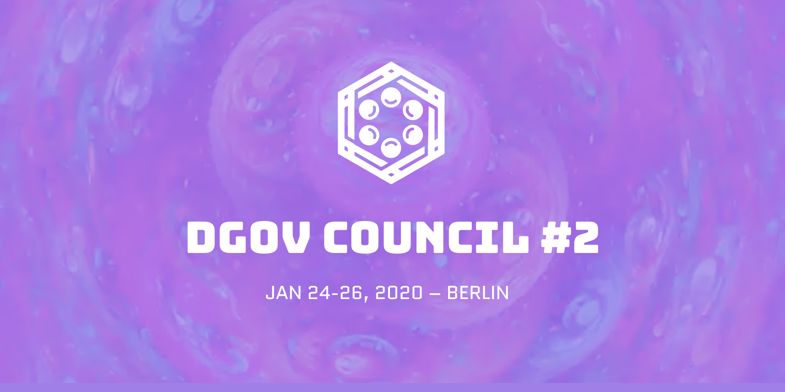

# Council / Think Tank

## Councils

Council is the community event that happens 2 times a year with the task to build more ties, exchange ideas from a lot of different fields and identify the working groups/group problems to work together. Collab starts online and only is getting to the peak at the council.

### Schedule

* Council \#1 \(Berlin\) - Jan 2019
* DGOV Assembly \(Paris\) - Mar 2019
* [DGOV Node at web3](https://forum.dgov.foundation/t/web-3-summit-dgov-node/63) - Aug 2019
* [DGOV Retreat Slovenia](https://forum.dgov.foundation/t/dgov-retreat-slovenia/69) - Sep 2019
* DGOV Retreat \#2 \(Berlin\) - Oct/Nov 2019
* Council \#2 \(Berlin\) - Jan 24th/26th 2020
* DGOV Retreat \#2 - Summer 2020
* DGOV Council \#3 - Winter 2021
* DGOV Festival \(Athens\) - Summer 2021
* + several smaller side events/Meetups

Need: Thought and people diversity \(coops, anthropologists etc\) \(can co-create with sponsors/community\).

## Council \#1 \(Jan 2019, Berlin\)



All videos: [https://www.youtube.com/watch?v=qTHHZN6bhlQ&list=PLDj0XyKkeYnfKo\_yGij3ciK8lI9f3\_VhL](https://www.youtube.com/watch?v=qTHHZN6bhlQ&list=PLDj0XyKkeYnfKo_yGij3ciK8lI9f3_VhL)

## Council \#2 \(Jan 2020, Berlin\)



Shared Vision:

"Creating human centric and scalable Governance Systems"

* Building meaningful interpersonal relationships with a shared vision
* Well hosted space \(good food, self organized time, break out areas\) 
* Support the production of knowledge for the dgov researchers
* Outline problems to work on
* Co-create concrete outcomes like an agenda for 2020 and partnerships
* Co-create a DGOV identity and vision for the movement
* Self-created and hosted working sessions facilitated by the DGOV team
* Support collaboration and communication for industry leaders and connecting with the wider DGOV ecosystem
* Being able to create a solid basis for future collaboration
* Build awareness & integration for external communities
* Facing complexity with diversity

**Propose your own Session!** 

\*\*\*\*[https://docs.google.com/forms/d/e/1FAIpQLSemDB-QBA2id1o-tfWYZ\_qKfpggMA2kVtehS74ALmLMh1Os8A/viewform?usp=sf\_link](https://docs.google.com/forms/d/e/1FAIpQLSemDB-QBA2id1o-tfWYZ_qKfpggMA2kVtehS74ALmLMh1Os8A/viewform?usp=sf_link)

* Learnings /Failures
* Prototypes
* Experiments
* Hands-on workshops
* Quality time together
* Talks / Conference
* Panels
* Money Games
* Remote calls
* Hacking
* Tool tests
* DGOV onboarding
* Yoga, massage, collective cooking
* Consultancy sessions

And whatever else comes to mind….  
****

